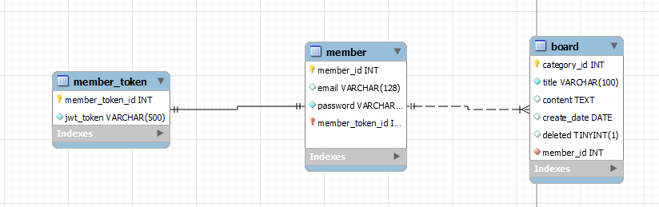

# wanted-pre-onboarding-backend 원티드 온보딩 미션
# 이름: 이경환
# 애플리케이션 실행 방법
```aidl
43.200.111.127:8080  ip에 접속하여 명세서에있는 api 호출
```

```aidl
//로컬에서
./gradlew build //빌드 후

docker build -t gamja123/boards . //도커 이미지 빌드

docker login //도커 로그인

docker push gamja123/boards // 도커 push

//ec2
docker login

docker pull gamja123/boards

docker docker-compose up
```

# DB 테이블 구조
## 요구사항
### [사용자,회원]

1. 사용자는`이메일`, `비밀번호`를 통해 가입한다.
2. 회원은 `이메일`로 식별한다.
3. 사용자는`이메일`, `비밀번호`를 통해 로그인 한다.

### [게시글]

1. 회원은 `게시글` 을 등록 할수 있다.
2. 회원은 `게시글` 을 조회 할수 있다.
3. 회원은 `게시글` 을 수정 할수 있다.
4. 회원은 `게시글` 을 삭제 할수 있다.

## 개념적 모델링
### ER-D

### 테이블 구성

## 인프라 구조

### 
# 구현 API 동작 데모 영상
# 구현 방법 & 이유
처음에는 password 테이블을 따로 두는 방향으로 선택하다(회원과 비밀번호는 별개의 것으로 처음에 생각했고
보안 상으로도 각 테이블을 따로 두는것이 좋다고 생각했습니다.) password는 member테이블의 필드로
가지는 것으로 변경했습니다. 아무래도 규모가 작다보니 불필요하게 느껴졌고 3개의 테이블을 가져가는 것으로
진행해습니다. token 같은 경우에는 로그인시 발행 되는 것으로 생각해 따로 테이블을 두고 null을 허용했습니다.

스프링 시큐리티를 처음에 사용해 필터 기능을 사용할까 했는데 스프링 시큐리티가 처음이라 학습 난이도에 어려움도있꼬
너무 무거워진다는 생각이들어 직접 인터셉터를, 아규먼트리졸버를 구현하여 jwt토큰이 발행될시
인터셉터해 header의 값을 분석하는 방법을 선택했습니다.

예외 처리같은 경우에는 커스텀 핸들러를 구현해 ResponseEntityExceptionHandler를 상속받도록해 공통 관심사로 처리했습니다.
aws에서 제공해주는 rds가 인스턴스 하나는 무료이기도하고 보안이이나 사용법이 강력한 것으로 알고있어
도입했습니다.

비밀번호는 security의 BCryptPasswordEncoder를 사용하여 암호화 했습니다. 사용법도 간단하고 직접 만들 필요 보다는 시큐리티를 학습
할겸 시도했습니다.

이메일,비밀번호는 controller에서 @vaild 어노테이션을 활용하여 검증하도록 했습니다.
yml을 그대로 push할경우 노출될 위험이 있다는 생각이들어 jasypt를 통해 암호화를 했습니다.

mok을 활용해 단위테스트를 하였습니다.

```aidl
version: "3"
services:
  application:
    build: .
    image: gamja123/boards
    container_name: was-application
    ports:
      - "8080:8080"
    environment:
      - JASYPT_SECRETE_KEY=암호
    restart: on-failure
```
docker-compose 는 다음과 같이 구성하였고
저는 ec2를 활용하였기 때문에
```aidl
docker login

docker pull gamja123/boards

docker docker-compose up
```

# API 명세

| 기능                 | HTTP Method       | URL                   |
|--------------------|-------------------|-----------------------|
| 회원 가입              | POST              | /api/members/signup   |
| 로그인                | GET               | /api/members/login    |
| 게시글 생성             | POST              | /api/boards           |
| 게시글 조회             | GET               | /api/boards           |
| 게시글 특정 게시글 조회      | GET               | /api/boards/{boardId} |
| 게시글 특정 게시글 수정      | PUT               | /api/board/{boardId}  |
| 게시글 특정 게시글 삭제      | DELETE            | /api/board/{boardId}  |

    회원가입
Request(requestBody)
```json 

{
  "email": "fds@fds.com",
  "password": "mysecretpassword"
}
```
Response
```json 

{
  1
}
```


    로그인
Request(requestBody)
```json 

{
  "email": "fds@fds.com",
  "password": "mysecretpassword"
}
```

    Response
```json 

{
    "jwtToken": "eyJhbGciOiJIUzI1Ni"
}
```
///////

    게시글 생성
Request(requestBody)
```json 

{
    "title": "새로운 게시글 제목",
    "content": "새로운 게시글 내용"
}

```
Response
```json 

{
  1
}


    게시글 전체 조회
Reponse
```json 

{
    "list": [
        {
            "title": "새로운 게시글 제목",
            "content": "새로운 게시글 내용"
        }
    ]
}
```

    게시글 특정 게시글 조회

Response
```json 

{
    "title": "새로운 게시글 제목",
    "content": "새로운 게시글 내용"
}
```
    게시글 특정 게시글 수정
Request(requestBody)
```json 

{
    "title": "수정 새로운 게시글 제목",
    "content": "수정 새로운 게시글 내용"
}

```
Response
```json 

{
  1
}
```

    게시글 특정 게시글 삭제
Response
```json 

{
  1
}
