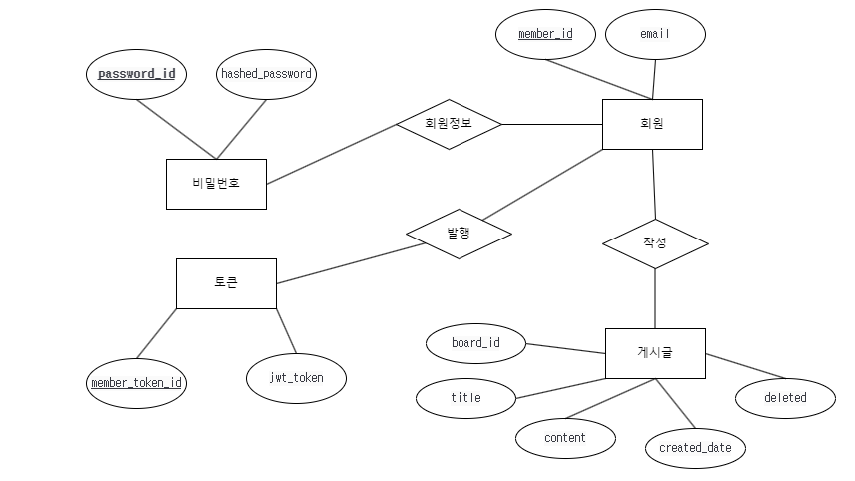
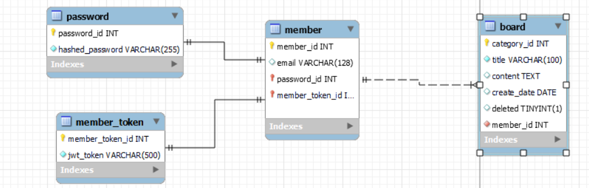
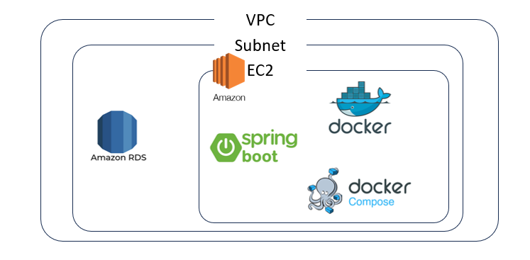

# wanted-pre-onboarding-backend 원티드 온보딩 미션
# 이름: 이경환
# 애플리케이션 실행 방법
# DB 테이블 구조
## 요구사항
### [사용자,회원]

1. 사용자는`이메일`, `비밀번호`를 통해 가입한다.
2. 회원은 `이메일`로 식별한다.
3. 사용자는`이메일`, `비밀번호`를 통해 로그인 한다.

### [게시글]

1. 회원은 `게시글` 을 등록 할수 있다.
2. 회원은 `게시글` 을 조회 할수 있다.
3. 회원은 `게시글` 을 수정 할수 있다.
4. 회원은 `게시글` 을 삭제 할수 있다.

## 개념적 모델링
### ER-D

### 테이블 구성

## 인프라 구조

### 
# 구현 API 동작 데모 영상
# 구현 방법 & 이유
# API 명세

| 기능                 | HTTP Method       | URL                   |
|--------------------|-------------------|-----------------------|
| 회원 가입              | POST              | /api/members/signup   |
| 로그인                | GET               | /api/members/login    |
| 게시글 생성             | POST              | /api/boards           |
| 게시글 조회             | GET               | /api/boards           |
| 게시글 특정 게시글 조회      | GET               | /api/boards/{boardId} |
| 게시글 특정 게시글 수정      | PUT               | /api/board/{boardId}  |
| 게시글 특정 게시글 삭제      | DELETE            | /api/board/{boardId}  |
